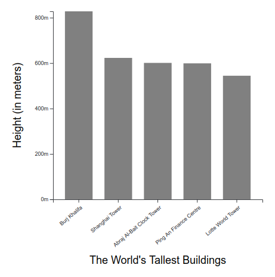

# Scales and Axes

According to Mike Bostock: 

> "Scales are functions that map from an **input domain** to an **output range**"

 

## Content

- **linear-scale.html**, **log-scale.html** and **band-scale.html**: Bar chart example revisited with new linear, log(10) and band scales added to it. See `./js/linear-scale.js`, `./js/log-scale.js` and `./js/band-scale.js` for the details.
- **time-scale.html**: simple example of how to work with time scales in D3. Code in `./js/time-scale.js`.
- **ordinal-scale.html**: how to work with ordinal scale in D3. In this example, we use `D3 scaleOrdinal` to assign different colors to an array of elements according to its position index (see `./js/ordinal-scale.js`).
- **automatic-domain.html**: bar chart example revisited to illustrate how we can use D3 builtin methods, such as `max`, `min`, `map` and `extent` to set and update our scales' domain automatically. (see `./js/automatic-domain.js`) 

 

## What I learned

- How to work with linear, logarithmic, time, ordinal and band scales in D3.
- How to set domains automatically with `D3 extent` and `map`.
- Create and work with svg groups and margins and how to add axis and labels to a chart.
- How to reverse the y axis so that a bar chart, for example, has the right orientation to the readers.

 

## Examples

Here are a few examples of charts I was capable of constructig after learning all the things listed above. 

### Simple Bar Chart (revisited)

Here I revisited the bar chart example of the section 1 (about `svg` basics) and made it look the way it should: with correct axis, labels and orientation.

    

## References

- [Udemy - Mastering data visualization in D3.js](https://www.udemy.com/course/masteringd3js)
- [D3 Tutorial on Observable](https://observablehq.com/@d3/learn-d3)
- [D3 Docs](https://github.com/d3/d3/wiki)
- [scaleTime example](https://bl.ocks.org/d3indepth/8948c9936c71e63ef2647bc4cc2ebf78)
- [scaleOrdinal example](https://bl.ocks.org/d3indepth/fabe4d1adbf658c0b73c74d3ea36d465)