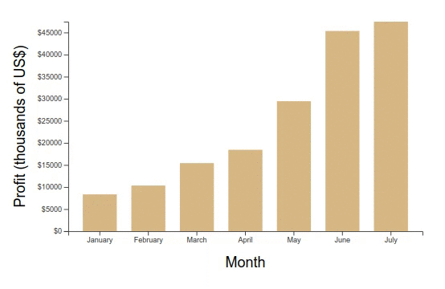

# Dynamic

Now it's time to learn how to add dynamic features (e.g., transitions) to static charts like the ones presented in section 2. In this folder I stored some examples and notes about `D3 update` pattern to make static charts react to new sets of data. 

 

## Content

- **dynamic-chart.html:** applying the `D3 update` pattern to make a dynamic chart that flicks between different data. Full code in `./js/dynamyc-chart.js`.
- **gapminder.html:** example that fully applies the `D3 update` pattern and transitions. (See `./js/gapminder.js` for full code)
- **interval-loops.html:** revisiting the coffee revenues bar chart example to ilustrate how the `D3 update` pattern works. (See `./js/interval-loops.js` for more details)
- **merge.html** the result is exactly the same as in `transition.html`. However, I refactored the code a little bit to apply `D3 merge` method. 
- **scatter-plot.html:** first scatter plot on D3. I've transformed the coffee revenues bar chart into a scatter plot by changing some `svg` attributes.
- **transition.html:** the same dynamic bar chart as in file `dynamic-chart.html`, but now with a smoother transition between data (applied `d3.transition().duration(500)` method). The code of the chart with this transition is in `./js/transition.js` file.

 

 

## What I learned

- How the `D3 update` pattern works, how to use it to animate charts (update it with new data) and how to set transitions to animations on the screen.

 

## Examples

### Coffee Revenues Bar Chart (revisited)

Here I revisited the coffee revenues bar chart from the previous section and added new elements to make it change to represent new added data. It was an important example for me to learn how to apply D3 transitions and the update pattern.

     

 

### Gapminder (clone)
Here is a slightly more complicated example that clearly illustrates how the D3 update pattern works.

     

 

## References

- [Udemy - Mastering data visualization in D3.js](https://www.udemy.com/course/masteringd3js)
- [D3 Tutorial on Observable](https://observablehq.com/@d3/learn-d3)
- [D3 Docs](https://github.com/d3/d3/wiki)
