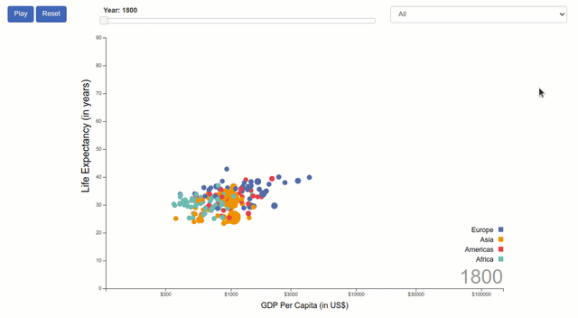
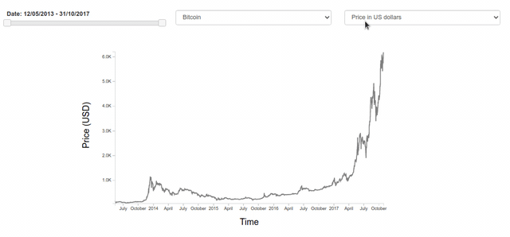

# Interactive

In this folder I explored some slightly more advanced features which allows the user to interact with the charts and further explore the data, maybe extracting some valuable insights. 

 

## Content

- **adding-legend.html:** revisited the gapminder example from previous section and added a legend to it. Now we can identify a continent by its color. See `./js/gapminder-legend.js`.
- **formatting-and-parsing.html**: example of how to use `D3 Format` for numbers, how to use string specifiers and use `D3 TimeFormat`and `TimeParse` to convert between strings and dates. All code for this is in `./js/formatting-and-parsing.js`.
- **tooltips.html:** once again I revisited the gapminder example. This time, I added tooltips to it with the d3-tip library. Details in `./js/tooltips.js`.
- **listeners-and-handlers.html:** short example of how to use listeners and handlers to add some interactive functionalities to a D3 chart. Code in `./js/listeners-and-handlers.js`.
- **jquery-slider.html:** example of how to add a UI slider using `jQuery UI library`. Complete code in `./js/jquery-slider.js`.
- **line-chart.html:** a short example of how to do a simple line chart in D3, using `d3.line`. Details are in `./js/line-chart.js`.

 

## What I learned

- How to add legend to a chart with `svg` groups.
- How to use D3 to format numbers, strings and convert between different formats. 
- How to use the d3-tip library to add tooltips to a D3 chart.
- How to use jQuery UI library to add a slider to a D3 visualization. 

 

## Examples

### Gapminder (revisited)

Here I revisited the gapminder example from the previous section (originaly presented by Hans Rosling in this [TED Talk](https://www.youtube.com/watch?v=hVimVzgtD6w&t=5s)) and added new elements to make it interactive, i.e., change as a reaction to user's selection. It was an important example for me to learn how to apply events listeners, handlers and learn how to add tooltips and format data to display to the user in an organized and clean manner.

     

### Cryptocurrencies Line Chart 

In this example I applied everything I've learned so far to do a line chart of cryptocurrencies price in US dollars. It was an important opportunity for me to practice how to use community's code and adapt it to a custom application. The credit also goes to the instructor of  [Udemy - Mastering data visualization in D3.js](https://www.udemy.com/course/masteringd3js) course for providing a sample code which helped me tolearn how to add elements to this chart (specially the tooltip) in a creative manner.

     

 

## References

- [Udemy - Mastering data visualization in D3.js](https://www.udemy.com/course/masteringd3js)
- [D3 Tutorial on Observable](https://observablehq.com/@d3/learn-d3)
- [D3 Docs](https://github.com/d3/d3/wiki)
- [D3 Format](https://github.com/d3/d3-format)
- [d3-tip](https://github.com/caged/d3-tip)
