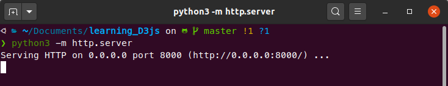

# learning_D3js
In this repository I'll store some personal study notes about D3.js and some example charts and projects I'm going to make in order to apply the new concepts and techniques about this JavaScript library.

<br>

## Contents

- **1-svg_basics:** in this folder you are going to find some basic review notes about the `svg` element. 

<br>

## Visualizing the contents in this repo

To visualize all `D3` files appropriately, you need to set up a basic `HTTP server` in your local machine. Next, I present two easy ways to do this: one using `Python 3` and a slightly more advanced one using `Node JS` and `NPM` (Node Package Manager). 

**p.s.:** for the sole purpose of seeing the content in this folder, I personally recommend the Python alternative as it is easier to install and implement in any operating system. But if you already use Node JS or simply don't want to install Python for any reason, I also present a way to do this using Node JS.

<br>

## Setting up HTTP Server with Python

First, for obvious reasons, you need to make sure that the Python 3 interpreter is installed in your system. To do this, just go to this [web page](https://www.python.org/), download the installation file according to your OS and follow the instalation steps. 

### Installing Python on Linux
If you are on linux, install Python can be as easy as running the following command (on Ubuntu): 

```shell
sudo apt install python3    # this will install the latest Python 3 version available for your system
```

If you're using other linux distribution, you need to replace `apt` for your distro's package manager. 

**p.s.:** chances are that you already have Python 3 pre-installed. you may want to verify it first by running the commands in the following section.

### Verifying instalation

Just open your terminal (or Windows command prompt) and type this:

```shell
python --version   # this may call the Python 2 interpreter if you have it in your system
```

or

```shell
python3 --version
```

**p.s.:** On windows you may need to follow some more steps to add Python to your system's PATH. [Here](https://geek-university.com/python/add-python-to-the-windows-path/) is a good reference to do this .

### Setting up the HTTP server

Once you have the `Python 3` interpreter set up and running in your machine, to set up a http server is as simple as 

```
python3 -m http.server
```

You'll see something like this in your terminal (or Windows cmd):




This means that the server is up and running at `http://localhost:8000/`. If you go to your favourite browser and navigate to this address, you should see this repo's structure like this:


To change the port, just execute

```
python3 -m http.server *port_number*  # you can add any port number you like
```

<br>

## Setting up HTTP Server with Node JS and NPM

Assuming you already have NodeJS and NPM installed (if you don't, see the following section for useful references), all you need to do is install the `http-server` package from NPM:

```shell
npm install -g http-server  # this install it globally. To install locally, remove -g  
```

Finally, to start the server, just navigate to this directory in terminal and execute:

```shell
http-server -p 8000
```

This will start the server at port 8000 and the result is similar to


Further options for the `http-server` library can be found [here](https://www.npmjs.com/package/http-server).

<br>

### Installing Node JS and NPM

If you need instructions to install `NodeJS` and `NPM`, here are some references you can look up for: 

> [Windows](https://phoenixnap.com/kb/install-node-js-npm-on-windows) - [Mac OS](https://treehouse.github.io/installation-guides/mac/node-mac.html)

Additionally, I added the steps I followed to install if on linux Ubuntu 20.04 on file [install_nodejs_ubuntu](./install_nodejs_ubuntu.md). If you are using another linux distribution, you may want to try the same steps replacing `apt` for your distro's package manager (like `dnf` for Fedora and `pacman` for Manjaro).

----