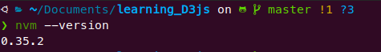
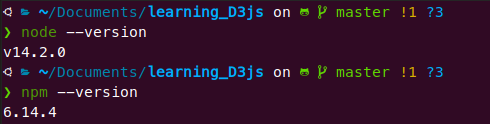

# Installing Node JS on Ubuntu

Okay, if you're a Ubuntu user for a while (or any other Debian-based linux distro), you may think that installing `NodeJS` and its package manager [NPM](https://www.npmjs.com/) is as easy as this:

```shell
sudo apt install nodejs npm
```

I did this and, surprisingly, it didn't work *'Out of the Box'*. The problem was that the `NPM` and `NodeJS` versions available on the official PPAs didn't get along very well. 

So, after reading lots of tutorials and testing many different forms of installing these two things, I find out that the best solution was to install them via [NVM](https://github.com/nvm-sh/nvm), which stands for *Node Version Manager* (it's useful to have `NVM` installed in your machine for plenty other reasons).

To get to the nitty-gritty, installing [NVM](https://github.com/nvm-sh/nvm) can be done by just running one the following commands in your terminal: 

```shell
curl -o- https://raw.githubusercontent.com/nvm-sh/nvm/v0.35.3/install.sh | bash
```
or 
```shell
wget -qO- https://raw.githubusercontent.com/nvm-sh/nvm/v0.35.3/install.sh | bash
```

<br>

**p.s.1:** if you don't have `curl`or `wget` in your system yet, just run

```shell
sudo apt install *package_name*   # just change *package_name* to your desired choice (curl or wget)
```

<br>

If all went well, the output of `nvm --version` should look like the following:



<br>

Now that `NVM` was successfully installed, we can install NodeJS and NPM by simply executing:

```shell
nvm install node   # this will install the latest version of NodeJS
```

Personally, I recommend **installing the LTS (*Long Term Support*) version** by running

```shell
nvm install node --lts   # Currently, the LTS version corresponds to 12.16.1 
```

And voilà. `NodeJS` and `NPM` were successfully installed with this simple command. If you want to check, the output of `node --version` and `npm --version` both should look like the following:



<br>